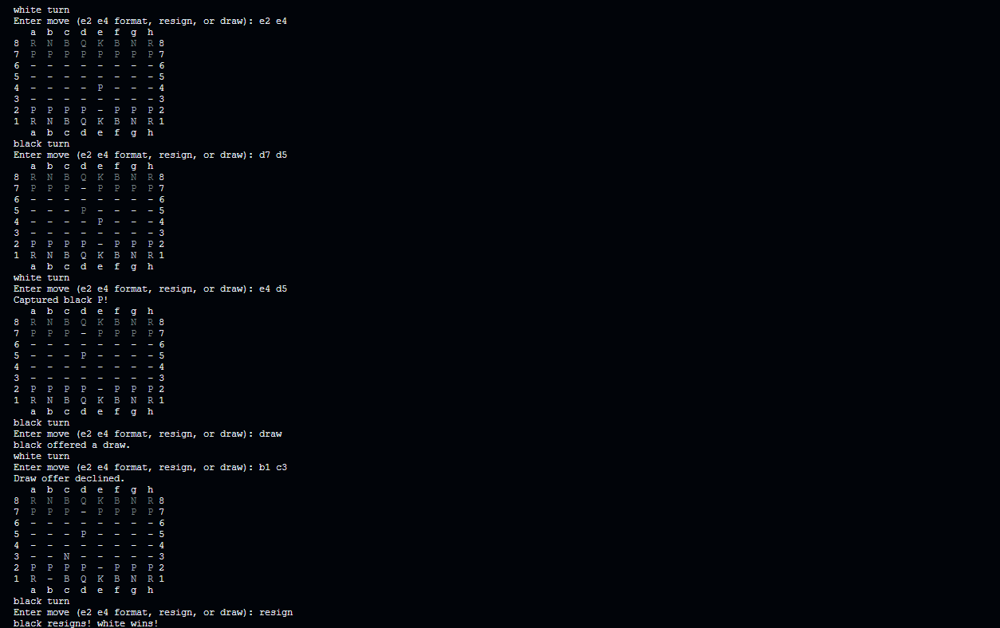

# Chess Java

Welcome to the **Chess Java** project! This is a terminal-based chess game implemented in Java, designed to provide an engaging and interactive experience for chess enthusiasts. The game incorporates classic chess rules, enabling players to challenge themselves against various pieces, including Knights, Bishops, Rooks, Queens, Kings, and Pawns.



## Table of Contents

- [Features](#features)
- [Getting Started](#getting-started)
- [Usage](#usage)
- [Gameplay](#gameplay)
- [Game Rules](#game-rules)
- [Contributing](#contributing)

## Features

- Playable chess game in the terminal.
- Supports all standard chess pieces with their respective movement rules.
- ANSI color codes for visually appealing text representation of pieces.
- Easy to understand and extend code architecture.

## Getting Started

### Prerequisites

To run the Chess Java game, you'll need:

- Java Development Kit (JDK) installed on your machine.
- An IDE or a text editor of your choice (e.g., IntelliJ IDEA, Eclipse, or VSCode).

### Installation

1. Clone the repository:

   ```
   git clone https://github.com/yourusername/chess-java.git
   cd chess-java
   ```

2. Open the project in your IDE or text editor.

3. Compile the code:

   ```
   javac src/*.java
   ```

## Usage

To run the game, execute the following command in your terminal:

```
java -cp src Game
```

## Gameplay

- The game starts with the standard chess setup.
- Players take turns to move their pieces according to chess rules.
- Invalid moves will be rejected, and players will be prompted to try again.

## Game Rules

### Basic Rules

- Each type of piece has its own movement rules:
  - **Pawn**: Moves forward one square; captures diagonally.
  - **Rook**: Moves horizontally or vertically any number of squares.
  - **Knight**: Moves in an "L" shape (two squares in one direction and then one square perpendicular).
  - **Bishop**: Moves diagonally any number of squares.
  - **Queen**: Moves horizontally, vertically, or diagonally any number of squares.
  - **King**: Moves one square in any direction.

### Winning the Game

- The game is won by checkmating the opponent's king, which means the king is in a position to be captured and cannot escape.

## Contributing

Contributions are welcome! If you have suggestions for improvements or new features, please fork the repository and create a pull request.

Thank you for checking out **Chess Java**! Enjoy playing and feel free to explore the code.
